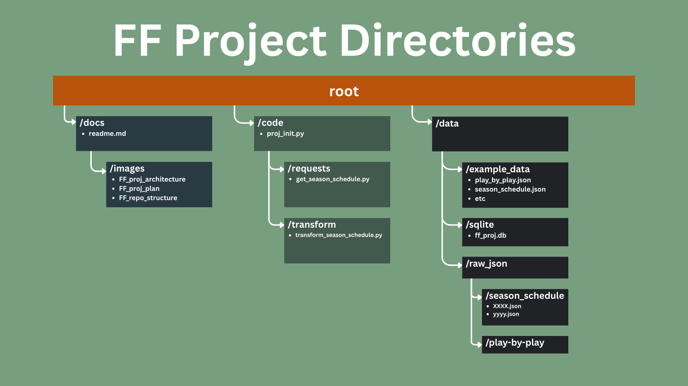
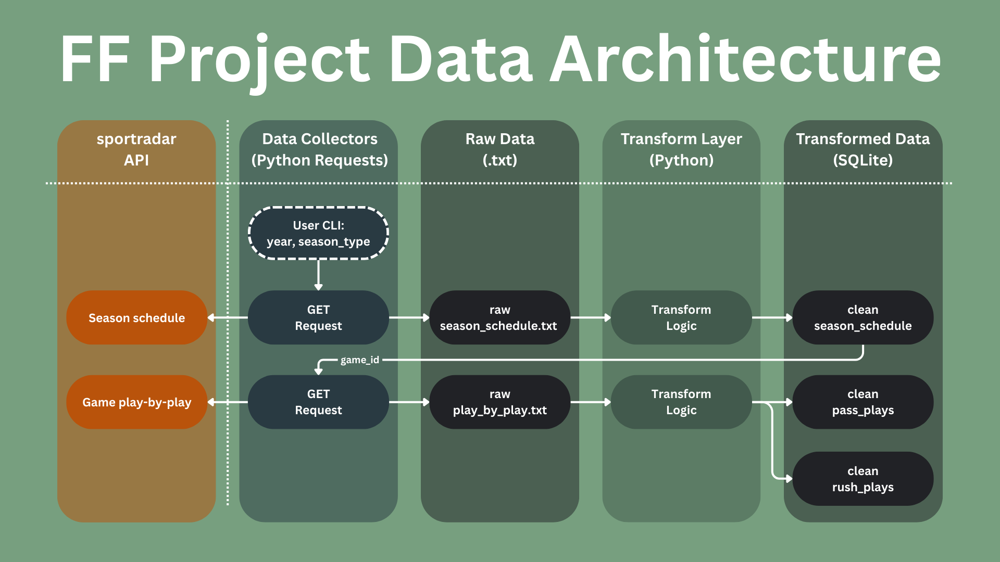
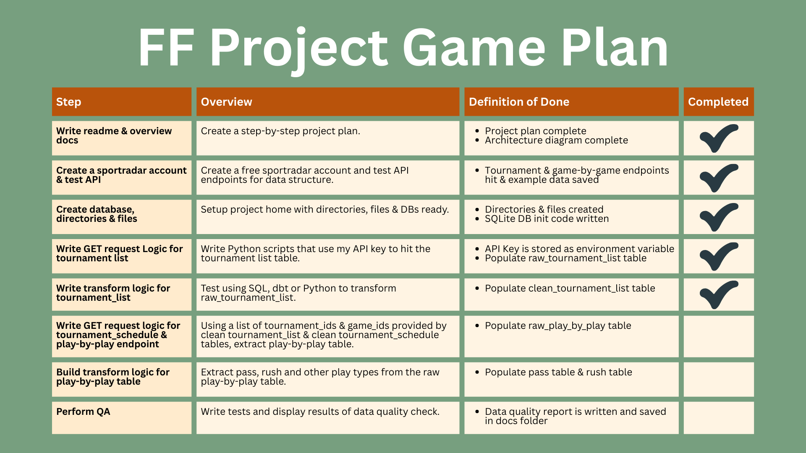

This project takes data from sportradar APIs, lands it and then transforms it into some basic tables. This data can then be used for analytics or dashboards in the next stage of the project.

The sportradar API has a "free trial" offer with up to 1 month and/or 1000 requests allowed. More details of the sportradar API can be found here: [Sportradar - Make your first call](https://developer.sportradar.com/getting-started/docs/make-your-first-call).

This project will use the below main tools:
- Python: for get requests, initialising SQLite databases, and more.
- SQL: for data transformations and analytics.
- SQLite: for a basic database setup.

This repository has the below directory structure:

The project architecture is below:

The project will follow the below steps:

